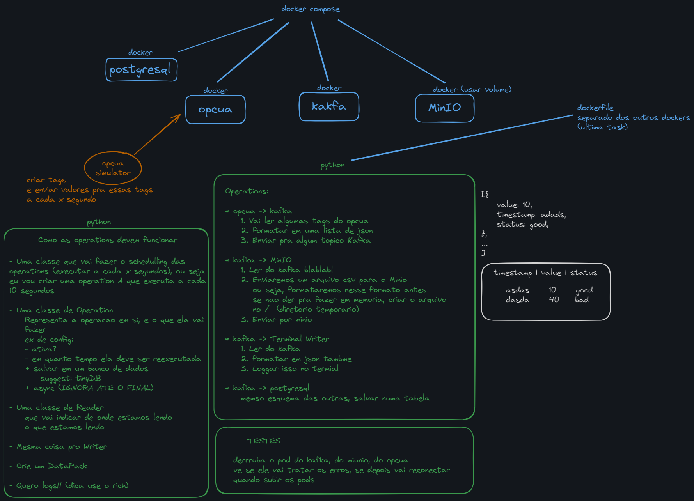
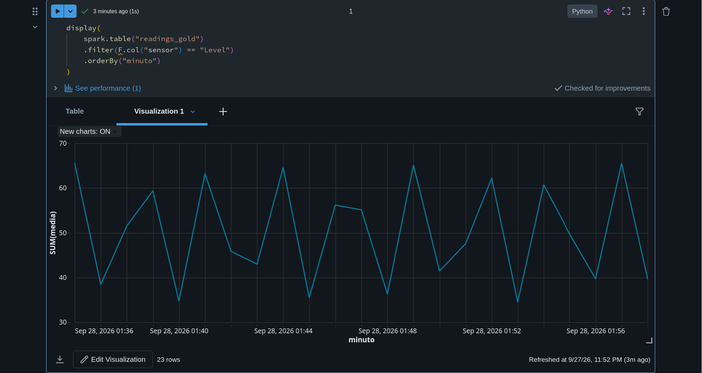
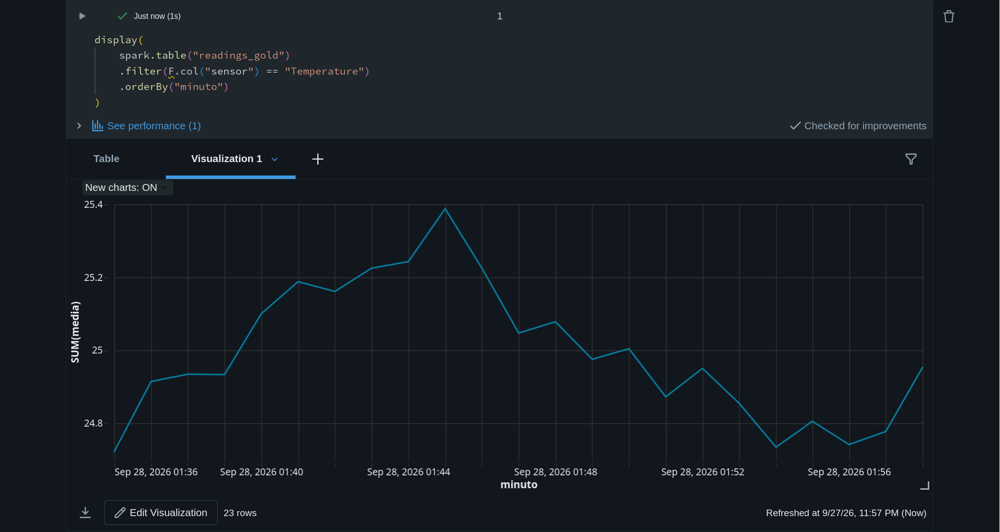

# Industrial Data Pipeline

Reads sensor tags from an OPC-UA server, publishes them to Kafka, and stores
them in Postgres and MinIO. Everything runs in Docker, and a Databricks
notebook turns the raw files into aggregated tables.

```
                          ┌──▶ Postgres   (SQL queries)
OPC-UA ──▶ Kafka ─────────┤
                          └──▶ MinIO ──▶ Databricks   (silver, gold)
```

## The challenge



## Goal

I build instrumentation but had never worked with the tools used to move data
at scale, so I built a pipeline that starts where I already know the ground —
an industrial protocol — and ends in a database. The point was to learn Kafka,
Docker and the shape of an ingestion pipeline by writing one.

The OPC-UA server is simulated, since I don't have a plant at home.

## Running it

```bash
docker compose up -d
docker compose logs -f pipeline
```

Five containers: the OPC-UA simulator, Kafka, Postgres, MinIO and the pipeline
itself. The pipeline waits for every dependency to report healthy before it
starts.

Check both destinations:

```bash
docker exec -it postgres psql -U pipeline -d telemetry \
  -c "SELECT * FROM readings ORDER BY id DESC LIMIT 10;"
```

MinIO console at `localhost:9001` (minioadmin / minioadmin) — files land under
`telemetry/readings/YYYY/MM/DD/`.

## How it works

`app/core.py` holds four pieces and no transport code at all:

- **DataPack** — one reading: tag, value, quality, timestamp
- **Reader** / **Writer** — contracts for where data comes from and goes to
- **Operation** — binds a reader to a writer and an interval
- **Scheduler** — runs the operations, isolating failures

The concrete classes live in `readers.py` and `writers.py`. Adding the MinIO
sink meant writing one class and one entry in `main.py` — nothing else changed.

Three operations run concurrently:

| Operation | Reads | Writes | Consumer group |
|---|---|---|---|
| `opcua->kafka` | four OPC-UA tags | one JSON message | — |
| `kafka->postgres` | the topic | `readings` table | `postgres-sink` |
| `kafka->minio` | the topic | dated CSV | `minio-sink` |

The two sinks use separate consumer groups, so each receives every message
rather than splitting them.

## Analytical layer

The CSVs in MinIO are the bronze layer of a lakehouse. A Databricks notebook
(`analytics/`) reads them and builds **silver** (bad readings and duplicates
dropped, node ids translated into sensor names) and **gold** (per sensor, one
-minute windows with count, mean, min, max and standard deviation), as Delta
tables — versioned and transactional.

### An aliasing artefact

Aggregating per minute makes Level look erratic while Temperature looks steady,
although both are clean sine waves:


*Level: mean per minute swings between 34 and 65*


*Temperature: mean per minute holds at 25*

The difference is the window, not the data. Temperature's period is 63 s, so a
one-minute window covers almost a full cycle and every window looks the same.
Level's period is 157 s, so each window samples a different slice of the wave.
A window shorter than the signal's period invents variation that isn't there.

## Delivery guarantees

The Kafka consumer runs with `enable_auto_commit=False`. Offsets advance only
after the writer confirms, in `Operation.execute`:

```python
await self.writer.write(packs)
await self.reader.commit()
```

A failed write leaves the offset untouched and the batch is retried next cycle.
This gives **at-least-once** delivery: nothing is lost, but a batch can be
written twice if the process dies between the write and the commit.
Exactly-once would need a transactional sink or a dedup key, and was left out
deliberately. The silver layer found zero duplicates across 1092 readings.

## Two timestamps

Each row carries `timestamp`, when the sensor measured, and `ingested_at`, when
it reached the database. The gap is the pipeline's end-to-end latency:

```sql
SELECT tag,
       round(avg(EXTRACT(EPOCH FROM (ingested_at - timestamp)))::numeric, 2) AS avg_latency_s
FROM readings GROUP BY tag;
```

Everything is stored in UTC and converted only for display.

## Resilience

Each dependency was killed mid-run and brought back:

| Failure | Result |
|---|---|
| Kafka down | All operations log and retry; process survives |
| Postgres down | Producer keeps publishing, backlog drains on recovery, nothing lost |
| Simulator down | Reconnects — after fixing the bug below |

The Postgres case is what justifies the design: readings accumulate in the
topic while the database is down, and the sink drains the backlog from its last
committed offset. A direct sensor-to-database connection would have dropped
every reading taken during the outage.

## What I learned

**Kafka isn't a queue, it's a log.** Messages stay after being read, and each
consumer group tracks its own position. That's what lets the Postgres sink and
the MinIO sink consume the same stream independently.

**Offsets should be committed after the write, not before.** With auto-commit
on, a failed database write would mark the messages as processed and lose them.

**Inside a container, `localhost` is the container.** The broker has to
advertise one address for clients on the host and another for containers, so
Kafka listens on 9092 and 9094 and advertises each separately. Connecting to
the wrong one hangs without a useful error.

**`depends_on` only orders startup, it doesn't wait for readiness.** The
pipeline raced Kafka and exited on a refused connection twice before health
checks were added.

**A healthy container can still be unreachable.** A partially failed
`--force-recreate` left the simulator running, healthy and attached to no
network at all. The symptom surfaced two layers away, as a DNS error in the
pipeline.

**Testing failure finds bugs that testing success doesn't.** Killing the
OPC-UA server showed the client object survived the dead session, so every
later read failed against a dead handle.

**The aggregation window can invent patterns.** Windowing a signal at less than
its period makes a regular sensor look erratic — the sampling theorem showing
up in a `groupBy`.

**Upstream can disappear.** MinIO pulled its images from Docker Hub partway
through this project and the build broke with no change on my side — a concrete
reason to pin versions and, in production, mirror images.

## Project layout

```
.
├── docker-compose.yml        five services with health checks
├── Dockerfile                the pipeline application
├── Dockerfile.simulator      the OPC-UA server
├── sql/init.sql              readings table and index
├── app/
│   ├── core.py               DataPack, Reader, Writer, Operation, Scheduler
│   ├── readers.py            OpcuaReader, KafkaReader
│   ├── writers.py            KafkaWriter, PostgresWriter, MinioWriter
│   ├── settings.py           endpoints and intervals, overridable by env
│   ├── simulator.py          OPC-UA server standing in for equipment
│   └── main.py               builds the operations, starts the scheduler
├── analytics/                Databricks notebook, silver and gold layers
└── export_for_databricks.py  concatenates the MinIO CSVs for upload
```

`sql/init.sql` only runs against an empty data directory. After changing the
schema: `docker compose down -v && docker compose up -d`.

## Useful commands

```bash
# what the producer is publishing, live
docker exec -it kafka /opt/kafka/bin/kafka-console-consumer.sh \
  --topic opcua.readings --bootstrap-server localhost:9092 --from-beginning

# how far behind each sink is
docker exec -it kafka /opt/kafka/bin/kafka-consumer-groups.sh \
  --bootstrap-server localhost:9092 --describe --group postgres-sink
```

## Next steps

- [ ] Read from MinIO directly in Databricks instead of uploading a CSV
